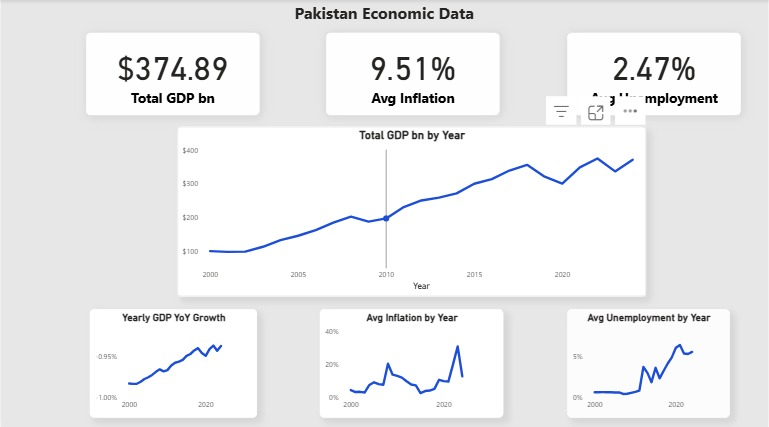

# Pakistan Economic Data Dashboard (Python + Power BI)

## Overview

This project analyzes Pakistan’s key macroeconomic indicators, including GDP, inflation, and unemployment, to understand long-term trends and economic patterns.

---

## Business Problem

Macroeconomic data is often spread across multiple sources and is not immediately usable for analysis. This project consolidates and transforms that data into a structured format, enabling clear analysis and visualization of Pakistan’s economic performance over time.

---

## Data Sources

* World Bank Open Data API
* Pakistan Bureau of Statistics (PBS)

---

## Tools & Technologies

* Python (pandas, requests)
* Google Colab
* Power BI
* DAX (Data Analysis Expressions)

---

## Methodology

1. Extracted macroeconomic data using the World Bank API
2. Cleaned and transformed datasets using Python (pandas)
3. Combined GDP, inflation, and unemployment into a single dataset
4. Built a star schema data model in Power BI
5. Created DAX measures for time-based analysis (e.g., year-over-year growth)
6. Developed an interactive dashboard for visualization

---

## Dashboard Preview

---

## Key Insights

* GDP shows a general upward trend with some fluctuations
* Inflation is more volatile and reacts strongly to short-term economic changes
* High inflation periods can reduce purchasing power despite GDP growth
* Unemployment trends indicate changes in labor market conditions over time

---

## Repository Structure

* `notebooks/` – Data extraction and preprocessing
* `data/processed/` – Cleaned dataset used for analysis
* `powerbi/` – Power BI dashboard file
* `images/` – Dashboard screenshot

---

## How to Use

1. Download the Power BI file from the `powerbi/` folder
2. Open it in Power BI Desktop
3. Explore the dashboard and interact with the visuals

---

## Author

Ahmad Umer
Business Analytics Student
